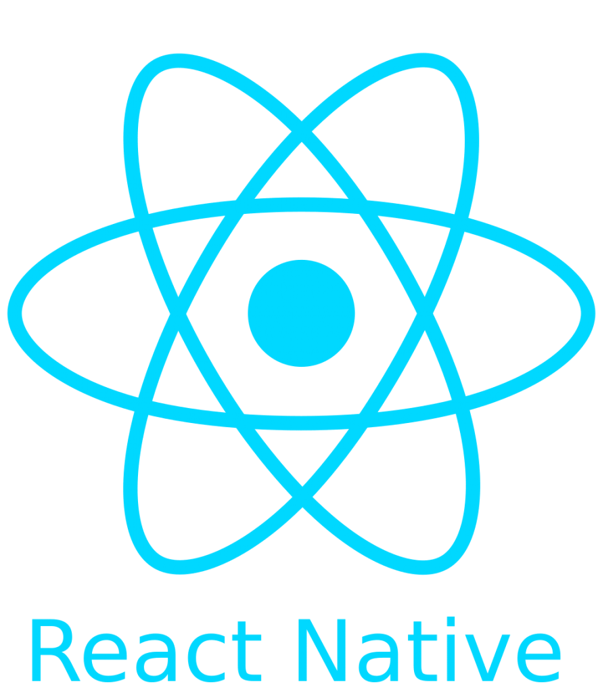

### Hei, Jeg er Serdar 👋

Denne oppgaven handler om CSS Tables 💪

  
  

### 📫 Kontakt meg:

### 🔭 Jeg jobber for tiden med:

<!--✨--> <!--✨--> <!--✨--> <!--✨--> <!--✨-->  <!--✨--> <!--✨--> <!--✨--> <!--✨--> <!--✨--> <!--✨--> <!--✨--> <!--✨--> <!--✨--> <!--✨--> <!--✨--> <!--✨--> <!--✨--> <!--✨--> <!--✨--> <!--✨--> <!--✨--> <!--✨--> <!--✨-->  <!--✨--> <!--✨--> <!--✨--> <!--✨-->

### Happy Coding! 😊